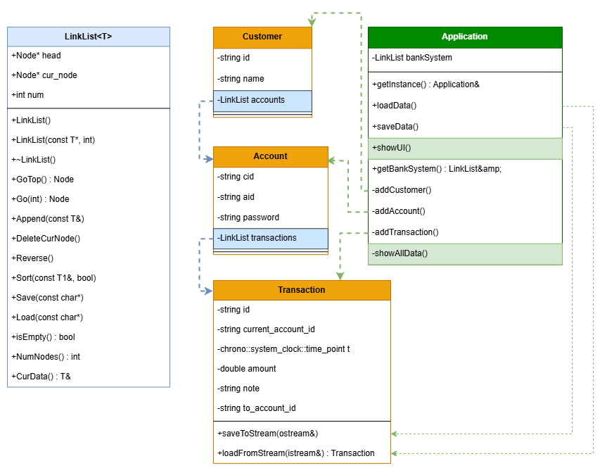

# 项目一：银行流水管理系统

## 1. 银行流水管理系统项目概述

### 1.1 项目内容及其应用

本项目旨在开发一个银行流水管理系统，能够管理客户、账户和交易记录。通过该系统，用户可以实现对银行账户的增删改查操作，记录交易流水，并生成相关的统计信息。该系统适用于银行后台管理，能够提高数据管理的效率和准确性。

### 1.2 涉及知识点

- 面向对象编程（OOP）
  - 类与对象
  - 模板类（`LinkList`）
- 数据结构
  - 链表
- 单元测试
  - 使用 GoogleTest 框架进行测试
- 构建工具
  - 使用 CMake 进行项目构建

## 2. 类的设计

### 2.1 数据成员设计
- `Customer` 类：包含客户的基本信息，如姓名、身份证号、联系方式等。
  - 数据成员：
    - `id`：客户身份证号（`include/models/customer.hpp` 第 6 行）。
    - `name`：客户姓名（`include/models/customer.hpp` 第 7 行）。
    - `accounts`：客户的账户列表（`include/models/customer.hpp` 第 8 行）。

- `Account` 类：包含账户的基本信息，如账户号、余额、账户类型等。
  - 数据成员：
    - `cid`：所属客户 ID（`include/models/account.hpp` 第 6 行）。
    - `aid`：账户 ID（`include/models/account.hpp` 第 7 行）。
    - `password`：账户密码（`include/models/account.hpp` 第 8 行）。
    - `transactions`：账户的交易记录（`include/models/account.hpp` 第 9 行）。

- `Transaction` 类：记录交易流水，包括交易时间、金额、交易类型等。
  - 数据成员：
    - `id`：流水号（`include/models/transaction.hpp` 第 6 行）。
    - `current_account_id`：当前账户 ID（`include/models/transaction.hpp` 第 7 行）。
    - `t`：交易时间（`include/models/transaction.hpp` 第 8 行）。
    - `amount`：交易金额（`include/models/transaction.hpp` 第 9 行）。
    - `note`：备注信息（`include/models/transaction.hpp` 第 10 行）。
    - `to_account_id`：对方账户 ID（`include/models/transaction.hpp` 第 11 行）。

- `Application` 类：作为系统的入口，管理客户、账户和交易的操作。
  - 数据成员：
    - `bankSystem`：全局数据存储（`include/app/application.hpp` 第 8 行）。

### 2.2 成员函数（友元函数）原型设计
- `Customer` 类：
  - `getName()`：获取客户姓名（`include/models/customer.hpp` 第 14 行）。
  - `getId()`：获取客户 ID（`include/models/customer.hpp` 第 17 行）。
  - `setName(const std::string& cname)`：设置客户姓名（`include/models/customer.hpp` 第 20 行）。
  - `getAccountList()`：获取客户账户列表（`include/models/customer.hpp` 第 23 行）。

- `Account` 类：
  - `getAid()`：获取账户 ID（`include/models/account.hpp` 第 13 行）。
  - `getCid()`：获取客户 ID（`include/models/account.hpp` 第 16 行）。
  - `getPassword()`：获取账户密码（`include/models/account.hpp` 第 19 行）。
  - `setPassword(const std::string& pass)`：设置账户密码（`include/models/account.hpp` 第 22 行）。
  - `getTransactionList()`：获取交易记录列表（`include/models/account.hpp` 第 25 行）。

- `Transaction` 类：
  - `getDateAsString()`：获取日期时间为字符串（`include/models/transaction.hpp` 第 16 行）。
  - `parseDate(const std::string& date_str)`：从字符串解析日期时间（`include/models/transaction.hpp` 第 21 行）。
  - `saveToStream(std::ostream& os)`：保存到输出流（`include/models/transaction.hpp` 第 26 行）。
  - `loadFromStream(std::istream& is)`：从输入流加载（`include/models/transaction.hpp` 第 31 行）。
  - `getCurrentAccountId()`：获取当前账户 ID（`include/models/transaction.hpp` 第 41 行）。
  - `getId()`：获取流水号（`include/models/transaction.hpp` 第 44 行）。
  - `getAmount()`：获取交易金额（`include/models/transaction.hpp` 第 47 行）。

- `Application` 类：
  - `getInstance()`：获取单例实例（`include/app/application.hpp` 第 11 行）。
  - `loadData()`：加载数据（`include/app/application.hpp` 第 13 行）。
  - `saveData()`：保存数据（`include/app/application.hpp` 第 14 行）。
  - `showUI()`：显示用户界面（`include/app/application.hpp` 第 15 行）。
  - `getBankSystem()`：获取银行系统数据（`include/app/application.hpp` 第 16 行）。

## 3. 测试情况

### 3.1 测试样例设计

#### 3.1.1 基本功能测试
- 测试 `LinkList` 的追加和访问功能（`tests/test_linklist.cpp` 第 5-13 行）。
- 测试 `LinkList` 的删除当前节点功能（`tests/test_linklist.cpp` 第 16-28 行）。
- 测试 `LinkList` 的反转功能（`tests/test_linklist.cpp` 第 31-42 行）。
- 测试 `LinkList` 的排序功能（`tests/test_linklist.cpp` 第 45-56 行）。
- 测试 `Application` 的添加客户功能（`tests/test_application.cpp` 第 6-20 行）。
- 测试 `Application` 的添加账户功能（`tests/test_application.cpp` 第 23-39 行）。
- 测试 `Application` 的添加交易功能（`tests/test_application.cpp` 第 42-61 行）。

#### 3.1.2 可靠性测试
- 测试重复添加相同 ID 的客户（`tests/test_application.cpp` 第 222-236 行）。
- 测试向不存在的客户添加账户（`tests/test_application.cpp` 第 239-252 行）。
- 测试加载不存在的文件（`tests/test_application.cpp` 第 255-268 行）。
- 测试空链表的操作（`tests/test_application.cpp` 第 271-283 行）。

#### 3.1.3 其他测试
- 测试边界条件：空字符串 ID（`tests/test_application.cpp` 第 286-297 行）。
- 测试性能：添加大量数据（`tests/test_application.cpp` 第 300-317 行）。

### 3.2 测试结果对程序的改进情况
- 修复了 `Application` 类中未正确处理重复 ID 的问题（`include/app/application.cpp` 第 124 行、第 180 行）。
- 增强了文件读取的异常处理逻辑，避免因文件缺失导致程序崩溃（`include/app/application.hpp` 第 13 行）。

### 3.3 草稿
- 增加对多线程环境下的测试，确保系统在并发操作下的稳定性。
- 增强对异常输入的测试覆盖，例如负数金额、超大金额等。
- 优化 `Transaction` 类的时间解析逻辑，确保跨时区的正确性。

